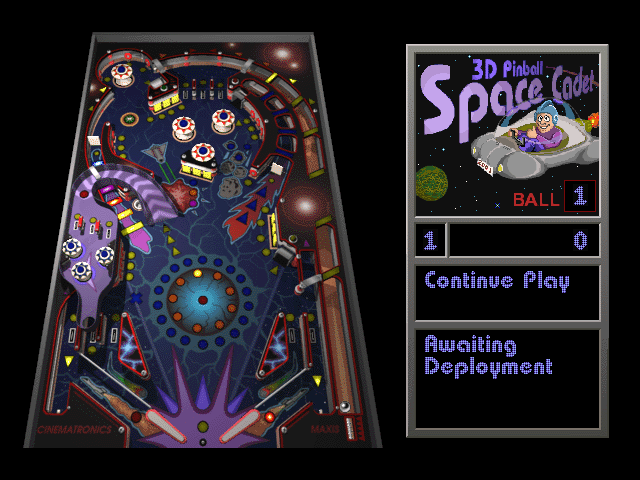

# 3D Pinball: Space Cadet — Miyoo Mini Plus / OnionOS Port

An unofficial port of [SpaceCadetPinball](https://github.com/k4zmu2a/SpaceCadetPinball) (the
community reverse-engineering/re-implementation of the classic "3D Pinball for Windows – Space
Cadet") to run as a standalone OnionOS Port on the **Miyoo Mini Plus** — a handheld with no 3D
graphics acceleration.

<p align="center">
  
</p>

This is the third port in the same series as [fallout1-ce-miyoomini](https://github.com/cacuracaptors/fallout1-ce-miyoomini) and [fallout2-ce-miyoomini](https://github.com/cacuracaptors/fallout2-ce-miyoomini) — if you're
curious how these ports came together, those repositories document the full journey.

Built on top of the work of [k4zmu2a](https://github.com/k4zmu2a/SpaceCadetPinball) and the SDL2
port for this hardware by [steward-fu](https://github.com/steward-fu/sdl2).

## ⚠️ You need your own game files

This repository does **not** include and will **never** include the game's data files
(`PINBALL.DAT`, `FONT.DAT`, `PINBALL.MID`, the `SOUND*.WAV` sound effects) — they are the property of
Interplay/Cinematronics/Microsoft (the game shipped with Windows for many years). You need a
legitimate copy of these files and must provide them yourself. See [Installation](#installation) below.

## Features

- Software rendering (the Miyoo Mini Plus has no 3D GPU)
- A full control scheme adapted for the Miyoo Mini Plus' hardware, which has no analog sticks
  (see [Controls](#controls))
- Sound effects working
- **Background music working**, converted automatically on first launch (see [Music](#music))
- The Menu key fires on **release**, not on press, so the OnionOS Menu+Power screenshot combo
  won't quit the game before you can take the screenshot

## Controls

| Button              | Action                 |
| ------------------- | ---------------------- |
| L1 / L2             | Left flipper           |
| R1 / R2             | Right flipper          |
| A / B               | Launch ball (plunger)  |
| D-pad Up            | Nudge table (bottom)   |
| D-pad Left          | Nudge table (left)     |
| D-pad Right         | Nudge table (right)    |
| X                   | Toggle sound effects   |
| Y                   | Toggle music           |
| Start               | Pause / Resume         |
| Select              | New game               |
| Menu key (Function) | Exit the game          |

## Music

The original game's music track (`PINBALL.MID`) is a real MIDI file, and this hardware's SDL2_mixer
build has no MIDI synthesizer — which is why earlier releases of this port shipped without music.

This port now solves that on the device itself. The first time you launch the game, it converts
`PINBALL.MID` to OGG Vorbis using a bundled [TiMidity++](https://sourceforge.net/projects/timidity/)
build and a [GeneralUser GS](https://github.com/mrbumpy409/GeneralUser-GS) soundfont, then starts
normally. A message is shown on screen while this happens.

Some notes:

- The conversion takes **up to 5 minutes**, and happens **only once**. Every launch after that
  starts immediately.
- Your original file is kept as `PINBALL.MID.original`, in the same folder.
- The converted file keeps the `PINBALL.MID` name on purpose: the game's music loader detects the
  format from the file's contents, not from its extension, so nothing else had to change.
- Don't delete the `midi-tool` folder that ships alongside the game — that's where the converter
  and the soundfont live. It's roughly 32 MB, which is most of this port's download size.
- Music is **off by default** in this game. Press **Y** in-game to turn it on.

## Installation

1. Download the latest `.zip` from the [Releases](https://github.com/cacuracaptors/spacecadetpinball-miyoomini/releases) tab of this repository.
2. Extract its contents to the root of your OnionOS SD card.
3. Copy the following files from your legitimate copy of the game into
   `Roms/PORTS/Games/Pinball/`:
   - `PINBALL.DAT`
   - `FONT.DAT`
   - `PINBALL.MID` (for music — optional, the game runs fine without it)
   - all `SOUND*.WAV` files
4. On the device, open the **Ports** menu — "3D Pinball Space Cadet" should appear in the list.
   If not, use "refresh roms" at the bottom of the list.
5. The first launch will take a few minutes while the music is converted (see [Music](#music)).

## Known issues

- **The first launch takes a few minutes** while the music is converted. This is one-time; see
  [Music](#music).
- **The game's built-in top menu bar and its ImGui-based dialogs (Show Control Dialog, the Exit
  confirmation popup) don't render/interact correctly on this hardware** — likely a rendering
  pipeline incompatibility between ImGui and this device's software-rendering SDL2 build.
  Showing the top menu bar also visibly shrinks/corrupts the play area, so `ShowMenu` is
  defaulted to `false` to avoid it entirely. We worked around the rest by hardcoding sensible
  default key bindings and a direct-quit shortcut instead of relying on these menus. This also
  means **in-game key rebinding doesn't work** on this device — if you want to change the
  controls, you'll need to edit and recompile `winmain.cpp`'s `miyooRemapKeycode()` function.
- **First-run settings caching**: this game saves its settings (including key bindings) to
  `Roms/PORTS/Games/Pinball/.local/share/SpaceCadetPinball/imgui_pb.ini` after the first launch.
  If you rebuild with different default key bindings, delete this file (or the whole `.local` folder) before testing, or the old saved settings will silently override your new defaults.

## Changelog

- **v1.1.0** — Background music now works. `PINBALL.MID` is converted to OGG Vorbis on the device,
  automatically, the first time you launch the game (see [Music](#music)). Added **Y** to toggle
  music. The Menu key now quits on release instead of press, so the OnionOS Menu+Power screenshot
  combo works without quitting the game first.
- **v1.0.0** — Initial release.

## Building from source

This port requires cross-compiling for ARMv7 hard-float using a Docker-based toolchain. Tested
on Windows + WSL2 + Docker Desktop.

### Prerequisites

- WSL2 with Ubuntu, and Docker Desktop with WSL integration enabled.

### Steps

```
mkdir -p ~/pinball-miyoo && cd ~/pinball-miyoo

# Cross toolchain
git clone https://github.com/shauninman/union-miyoomini-toolchain.git

# SDL2 ported for the Miyoo Mini (Plus)
git clone https://github.com/steward-fu/sdl2.git sdl2-miyoo

# This repository (already patched)
git clone https://github.com/cacuracaptors/spacecadetpinball-miyoomini.git SpaceCadetPinball
```

**1) Build the Miyoo Mini SDL2** (inside `sdl2-miyoo`, via Docker — see the [steward-fu/sdl2](https://github.com/steward-fu/sdl2) instructions for the full `make cfg && make gpu && make sdl2` process).

**2) Build SDL2_mixer** (OGG-only — the MIDI backend stays off, since music is converted to OGG
ahead of time instead):

```
git clone --branch SDL2 https://github.com/libsdl-org/SDL_mixer.git sdl2-mixer
```

Cross-compile it with the same toolchain, pointing `-DSDL2_INCLUDE_DIR`/`-DSDL2_LIBRARY` at the `sdl2-miyoo` build from step 1, and:

```
-DSDL2MIXER_FLAC=OFF -DSDL2MIXER_MOD=OFF -DSDL2MIXER_MP3=OFF -DSDL2MIXER_MIDI=OFF \
-DSDL2MIXER_OPUS=OFF -DSDL2MIXER_WAVPACK=OFF -DSDL2MIXER_SAMPLES=OFF
```

**3) Build SpaceCadetPinball** using the cross toolchain:

```
cd union-miyoomini-toolchain
make shell
```

Inside the container:

```
cd ~/workspace/SpaceCadetPinball

cmake -B build \
  -DCMAKE_TOOLCHAIN_FILE=toolchain-miyoomini.cmake \
  -DCMAKE_MODULE_PATH=$(pwd)/CMakeModules \
  -DCMAKE_BUILD_TYPE=Release \
  -DSDL2_INCLUDE_DIR=/root/workspace/sdl2-miyoo/sdl2/include \
  -DSDL2_LIBRARY=/root/workspace/sdl2-miyoo/sdl2/build/.libs/libSDL2.so \
  -DSDL2_MIXER_INCLUDE_DIR=/root/workspace/sdl2-mixer/include \
  -DSDL2_MIXER_LIBRARY=/root/workspace/sdl2-mixer-build/libSDL2_mixer-2.0.so.0 \
  -DCMAKE_EXE_LINKER_FLAGS="-Wl,--allow-shlib-undefined"

cmake --build build -j4
```

The final ARM (armhf) binary `SpaceCadetPinball` will be in `bin/`. You'll also need to ship `libSDL2-2.0.so.0` and `libSDL2_mixer-2.0.so.0` alongside it (plus `libEGL.so`/`libGLESv2.so`/ `libjson-c.so.5`, dependencies of the SDL2 build — see the Fallout ports' READMEs for where
these come from).

**4) Build TiMidity++ for ARM** (only needed if you want to rebuild the music converter). Configure
it for this toolchain with Ogg Vorbis as the output driver. Two things make cross-compiling it
awkward: several `configure` checks try to *run* a test binary, so their results have to be
pre-seeded (`lib_cv_va_copy=yes lib_cv___va_copy=no lib_cv_va_val_copy=no`), and the `calcnewt`
helper — which generates a lookup table at build time — has to be compiled natively for x86_64
rather than for ARM, since it runs during the build itself.

### What this fork changes (compared to upstream SpaceCadetPinball)

- **`SpaceCadetPinball/winmain.cpp`** — the full physical-button-to-game-action remapping
  (`miyooRemapKeycode()`), translating this device's fixed hardware→keycode mapping onto the
  game's existing keyboard-based control scheme, plus a direct-quit shortcut bypassing a broken
  ImGui confirmation dialog on this hardware (see Known issues). The Menu key's quit fires on key
  release rather than key press, so the OnionOS Menu+Power screenshot combo doesn't quit the game
  before Power can be pressed.
- **`SpaceCadetPinball/options.cpp`** — changed the default key bindings for Left Flipper and
  Right Flipper to match keys this hardware can actually produce, and defaulted `ShowMenu` to
  `false` (see Known issues below for why).
- **`SpaceCadetPinball/TPlunger.cpp`** — widened the plunger's post-release collision window
  from 25ms to 150ms. On this hardware's slower/less consistent update rate, a fully charged
  shot would often do nothing because the ball was no longer touching the plunger by the time
  the original, much shorter window closed.
- **`pinball-launcher.sh`** (shipped in the release, not a source change) — runs in place of the
  game executable and performs the one-time MIDI→OGG music conversion described in [Music](#music).

## Credits

- [k4zmu2a](https://github.com/k4zmu2a) — SpaceCadetPinball
- [steward-fu](https://github.com/steward-fu) — SDL2 for the Miyoo Mini (Plus)
- [shauninman](https://github.com/shauninman) — union-miyoomini-toolchain
- [TiMidity++](https://sourceforge.net/projects/timidity/) — MIDI to audio conversion (GPL)
- [GeneralUser GS](https://github.com/mrbumpy409/GeneralUser-GS) by S. Christian Collins — the
  soundfont used for the conversion
- Cinematronics / Maxis / Microsoft — the original 3D Pinball for Windows – Space Cadet (1995)

## License

This port's source code follows the same license as upstream SpaceCadetPinball. See `LICENSE` in this repository.

The bundled TiMidity++ build is distributed under the GPL, and the GeneralUser GS soundfont under
its own permissive license; see `midi-tool/` in the release for the accompanying license files.
